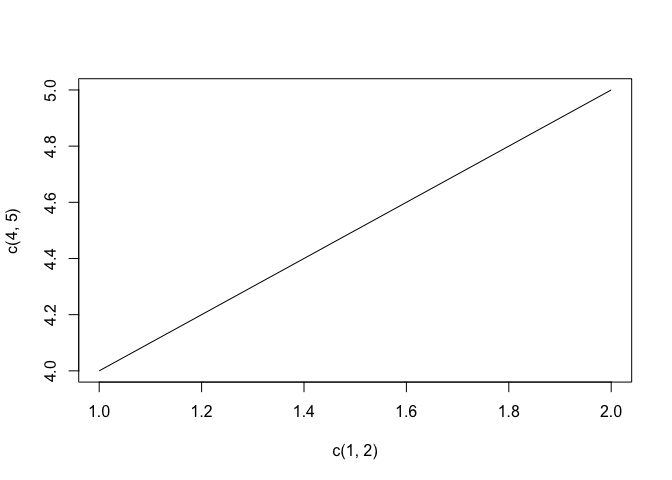

## Trying this blog thing out

::: cell
``` {.r .cell-code}
1 + 1
```

::: {.cell-output .cell-output-stdout}
    [1] 2
:::
:::

Science!

## Fiddling

::: cell
``` {.r .cell-code}
plot(c(1,2),c(4,5), type = "l")
```

::: cell-output-display

:::
:::

### Galavanting
